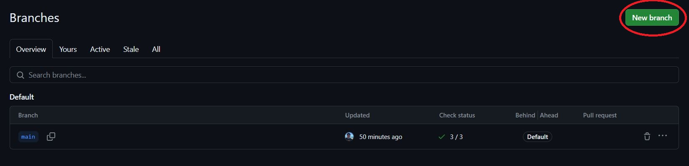
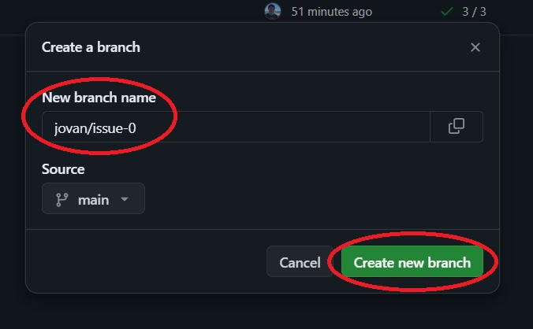
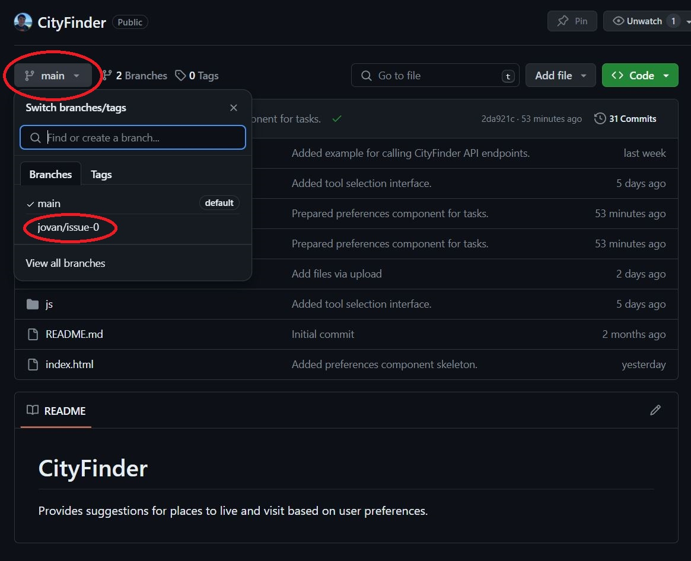
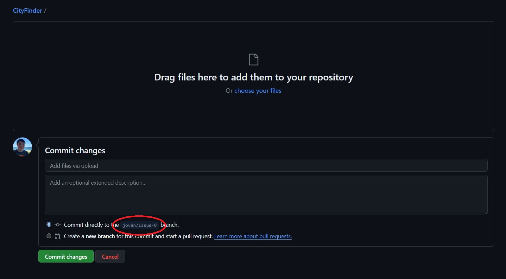

# CityFinder
Provides suggestions for places to live and visit based on user preferences.

## Branch Workflow
To ensure changes are being appropriately pushed to this repository, especially as multiple people begin to work on the same files, we will be utilizing branches to separate our work. A branch "allows you to develop features, fix bugs, or safely experiment with new ideas in a contained area of your repository" (i.e., your changes will not affect anyone else's changes).

Please follow the below steps when working on your issues:
1. **Go to https://github.com/jovanyoshioka/CityFinder/branches and create a new branch by clicking the "New branch" button in the top right corner.**  

2. **Use the following format for branch names: `[yourname]/issue-[#]`. The `#` is the issue number that you are making changes for. You can find this number next to the title of your issue (e.g., "Select Color Scheme #1"). Click "Create new branch" to continue.**  

3. **Go to https://github.com/jovanyoshioka/CityFinder and click on "main" in the top left. Then, click the branch that you just created. The `[yourname]/issue-[#]` should appear in the list. This will switch you to your branch, thus isolating any changes you make from everyone else.**  

4. **When uploading files for your issue, ensure that you are uploading to the correct branch.**  
