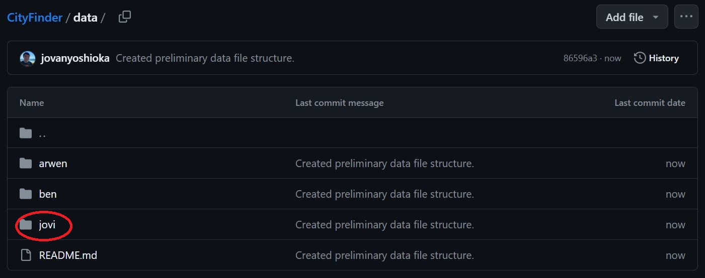
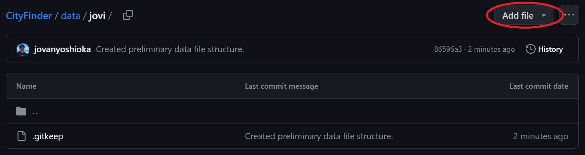
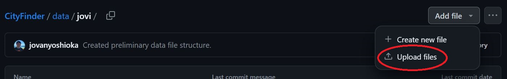
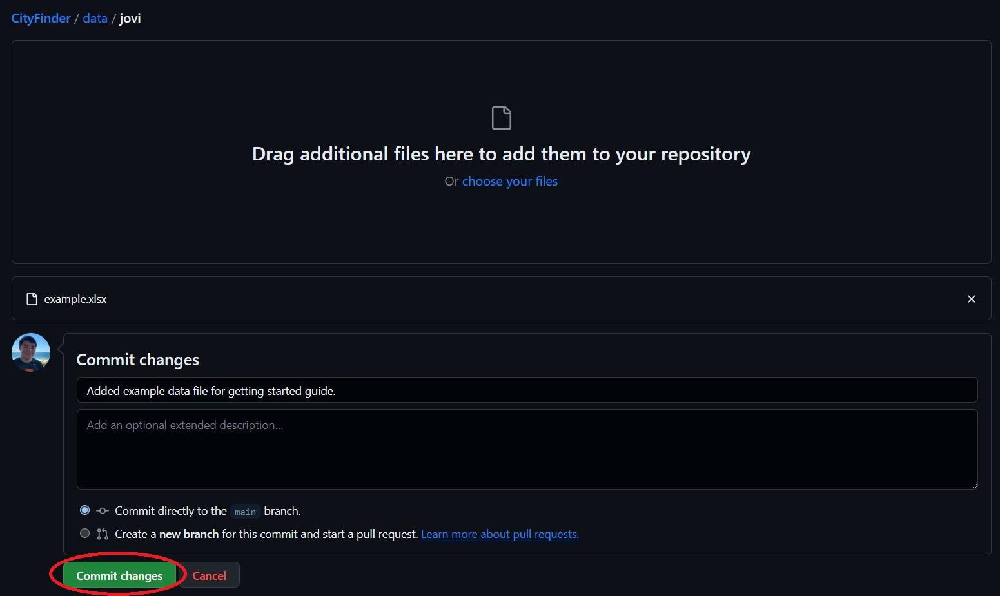
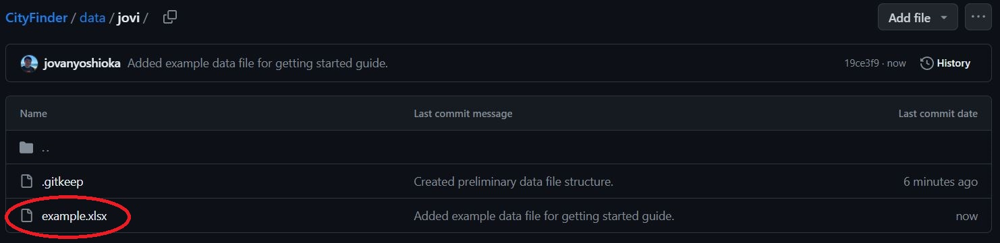
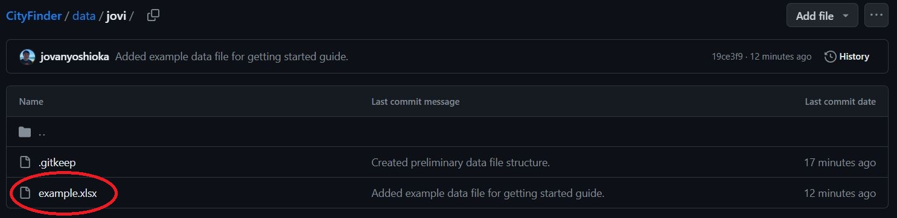
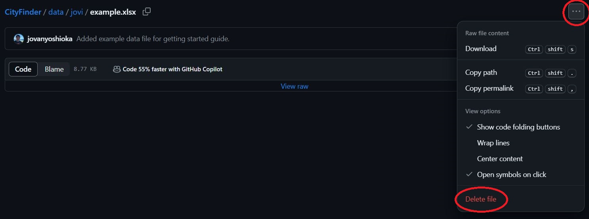
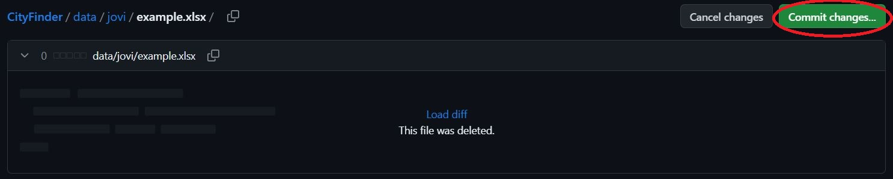
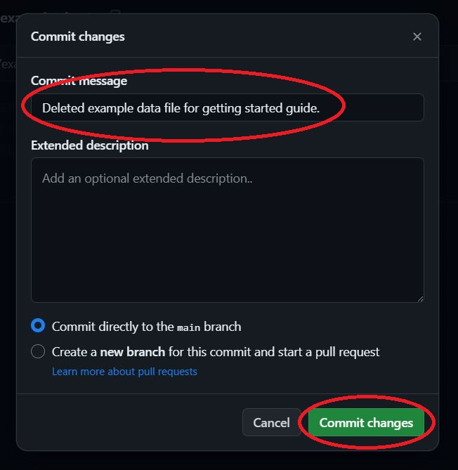
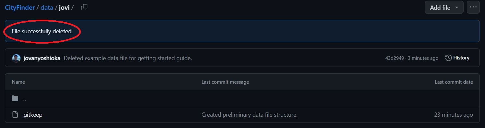

# Getting Started

## To upload your files to this repository, follow the steps below:
1. **Click on the folder with your name.**  

2. **Click on the "Add file" button.**  

3. **Click on the "Upload files" button.**  

4. **Upload your files by dragging or choosing them. Also, add a short description of what you are adding.**  

5. **Click "Commit changes" to save your files to the repository.**  

6. **Navigate to the folder with your name, as completed in Step 1. If your files appear, you have successfully uploaded them!**  

## To delete files from this repository, follow the steps below:
1. **Click on the file/folder that you wish to delete.**  

2. **Click on the 3-dot button, then click the "Delete file" button.**  

3. **Click the "Commit changes..." button.**  

4. **Add a short description of what you are deleting. Then, click the "Commit changes" button.**  

5. **You should receive a notification if the deletion was successful.**  
